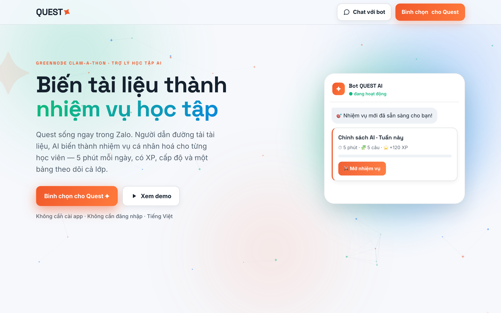

<p align="center">
  <picture>
    <source media="(prefers-color-scheme: dark)" srcset="brand/logo-quest-dark.png">
    
  </picture>
</p>

An AI study-companion that lives inside **Zalo**. A teacher uploads documents → AI turns them into
**personalized, adaptive, gamified quests** → learners do 5-minute graded missions via the Zalo bot →
a dashboard tracks the whole class and answers questions in natural language. Vietnamese-first, no app,
no login.

> **Nhận nhiệm vụ. Lên cấp.** — learning that comes to you, in the app you already use.

Built for the **GreenNode Claw-a-thon** on **GreenNode Serverless AI** (Gemma · Qwen3.5 · MiniMax) +
**GreenNode AgentBase** (Docker runtime).

<p align="center">
  
</p>

## The loop
```
Teacher uploads docs → AI builds a Course Pack (concepts + questions)
  → bot sends a learner a personalized quest link in Zalo
  → tap → adaptive, BKT-graded 5-min quiz (XP / level / streak)
  → mastery profile updates → dashboard + AI insights + next quest tunes to it
```

## Why it's different
- **No app, no login** — it runs inside Zalo, the chat app learners already keep open: a styled message + a signed link.
- **Personalized per learner** — Bayesian Knowledge Tracing models each person's mastery, so their next quest skips what they know and matches difficulty to where they are.
- **Code orchestrates, AI does language** — grading, mastery math, question selection, and PII scrubbing are plain deterministic code; the model is called only for discrete language tasks, each with a non-AI fallback.
- **Vietnamese-first & gamified** — XP, levels, streaks, and honest re-engagement nudges, never bait.

## Features
**Teacher (Người dẫn đường)** — create a class from the bot (`tạo lớp`); upload materials (PDF / DOCX / paste);
build quests with an optional "yêu cầu thêm" instruction. Quests broadcast to the class, with per-quest redo,
attempt limits, and an active window — toggle, re-send, or remind the unfinished. Dashboard with charts +
**ask-your-class**; public/private classes with waitlist approval.

**Learner (Anh hùng)** — join with an invite code; a personalized **adaptive** quiz that skips mastered
concepts and matches difficulty to your mastery; instant grading, XP, levels, streaks, and a congrats in
Zalo on finishing (redos celebrate the improvement vs last time).

**AI** — 3-model routing on GreenNode (Gemma gate · Qwen tutor · MiniMax reasoner); **Bayesian Knowledge
Tracing** for per-member mastery; a **growth agent** that writes honest, personalized study reminders;
grounded generation + PII guardrails.

**Admin** — owner-only portal (bot-issued, signed, short-lived link) listing every class with stats + cleanup.

**The cast** (game-themed, Vietnamese): Người dẫn đường = teacher · Anh hùng = learner · Đội = class ·
Nhiệm vụ = quest · Thử thách = question · Bảng theo dõi = dashboard.

## Stack
Node 20 · TypeScript · Express · Postgres (`pg`) · Zalo Bot API · GreenNode Serverless AI (OpenAI-compatible) ·
`multer` + `pdf-parse` + `mammoth` (file ingest) · `jsonwebtoken` (temp links) · `zod` (env). Deployed as a
Docker image on GreenNode AgentBase.

## Run (dev)
```bash
npm install
cp .env.example .env        # then fill in the secrets (see below)
npx tsx src/db/migrate.ts   # create/upgrade tables (idempotent)
npx tsx src/index.ts        # serves on PORT (3030)
```
For the Zalo webhook you need public HTTPS → point an ngrok/cloudflared URL at `:3030`, set it as
`BASE_URL`, then `npm run webhook:set`. Open `http://localhost:3030/` (landing) or text the bot `tạo lớp`.

**Required `.env`:** `ZALO_BOT_TOKEN`, `ZALO_WEBHOOK_SECRET`, `BASE_URL`, `GREENNODE_API_KEY`,
`DATABASE_URL`, `JWT_SECRET`, `OWNER_CHAT_ID`. Other vars have defaults — see [`.env.example`](.env.example).

## Scripts
| command | does |
|---|---|
| `npx tsx src/index.ts` | run the server (or `npm run dev` for watch) |
| `npx tsx src/db/migrate.ts` | apply schema (safe to re-run) |
| `npx tsx src/scripts/seed-demo.ts` | seed a demo class (An / Minh / Lan + a quest) → prints links |
| `npx tsx src/scripts/nudge.ts <classId>` | send the growth-agent reminder to a class |
| `npx tsx src/scripts/open-due.ts` | scheduled-open tick: ping classes when a scheduled quest's open time arrives (cron) |
| `npx tsx src/scripts/codes.ts [courseId]` | print a class's invite/link codes |
| `npm run webhook:set` | getMe + setWebhook + getWebhookInfo |
| `npm run typecheck` | `tsc --noEmit` |
| `npm run build` / `npm start` | compile → run `dist/` |

## Bot commands
`<invite code>` join a class · `<link code>` become its teacher · `tạo lớp` create a class ·
`xem lớp` / `lớp của tôi` / `quản lý` list & manage your classes · `học` all currently-open quests ·
`admin` (owner only) admin link.

## Deploy (GreenNode AgentBase)
Docker image on GreenNode AgentBase — listens on **`:8080`**, exposes **`/health`**. Push the image, set the
runtime's env + gateway, and map your domain's DNS to the gateway.

The same image also serves a marketing/voting page at **`/pitch`**, and at the root of any host listed in
`PITCH_HOST` (so a custom domain points straight at it).

## Project layout
See [`CLAUDE.md`](CLAUDE.md) for the full map and conventions. Top level:
```
src/{index,config}.ts · src/llm · src/zalo · src/db · src/domain · src/skills · src/api · src/pages · src/scripts
```
